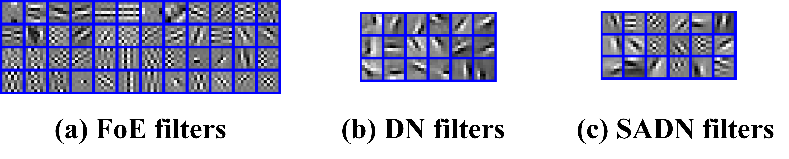

# SADN (Synthesis-analysis deconvolutional network for compressed sensing)  
%% The Code is created based on the method described in the following papers:   
% Q. Liu, H. Leung, "Synthesis-analysis deconvolutional network for compressed sensing," Image Processing (ICIP), 2017 IEEE International Conference on. IEEE, 2017: 1940-1944.  
% Author: Q. Liu, H. Leung  
% Date : 09/2018   
% Version : 1.0  
% The code and the algorithm are for non-comercial use only.   
% Copyright 2018, Department of Electronic Information Engineering, Nanchang University.  
% SADN - Synthesis-analysis deconvolutional network  

## Visual illustration of learned filters.

 
The sample filters learned with: (a) FoE filters, (b) DN filters, and (c) SADN filters.

## Other Related Projects
  * Predual dictionary learning (PDL) / augmented Lagrangian multi-scale dictionary learning(ALM-DL) [**[Paper]**](http://www.escience.cn/people/liuqiegen/index.html;jsessionid=5E20FEE3694E8BB3249B64202A8E25C8-n1)   [**[Code]**](https://github.com/yqx7150/PDL_ALM_DL_code) 
  
  * Adaptive dictionary learning in sparse gradient domain for image recovery [**[Paper]**](https://ieeexplore.ieee.org/document/6578193/)   [**[Code]**](https://github.com/yqx7150/GradDL) 

  * Highly undersampled magnetic resonance image reconstruction using two-level Bregman method with dictionary updating [**[Paper]**](https://ieeexplore.ieee.org/document/6492252)   [**[Code]**](https://github.com/yqx7150/TBMDU) 
  
  * Convolutional Sparse Coding in Gradient Domain for MRI Reconstruction [**[Paper]**](http://html.rhhz.net/ZDHXBZWB/html/2017-10-1841.htm)   [**[Code]**](https://github.com/yqx7150/GradCSC)
    
  * Field-of-Experts Filters Guided Tensor Completion [**[Paper]**](https://ieeexplore.ieee.org/document/8291751/similar#similar)   [**[Code]**](https://github.com/yqx7150/FoE_STDC)   [**[Slide]**](https://github.com/yqx7150/EDAEPRec/tree/master/Slide)
   
  * Sparse and dense hybrid representation via subspace modeling for dynamic MRI [**[Paper]**](https://www.sciencedirect.com/science/article/abs/pii/S089561111730006X)   [**[Code]**](https://github.com/yqx7150/SDR)
